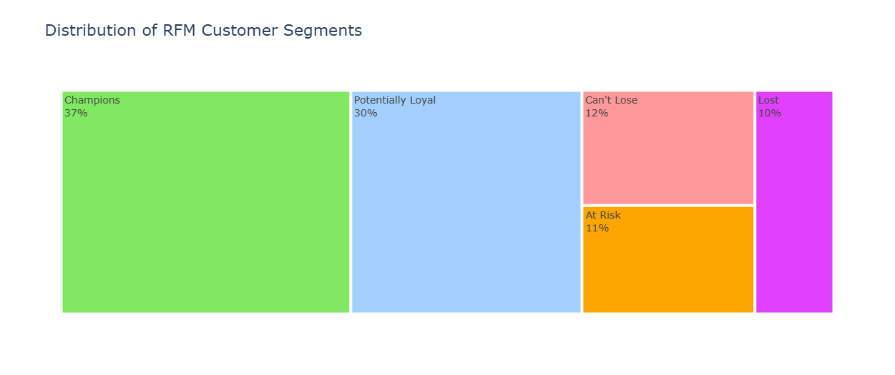
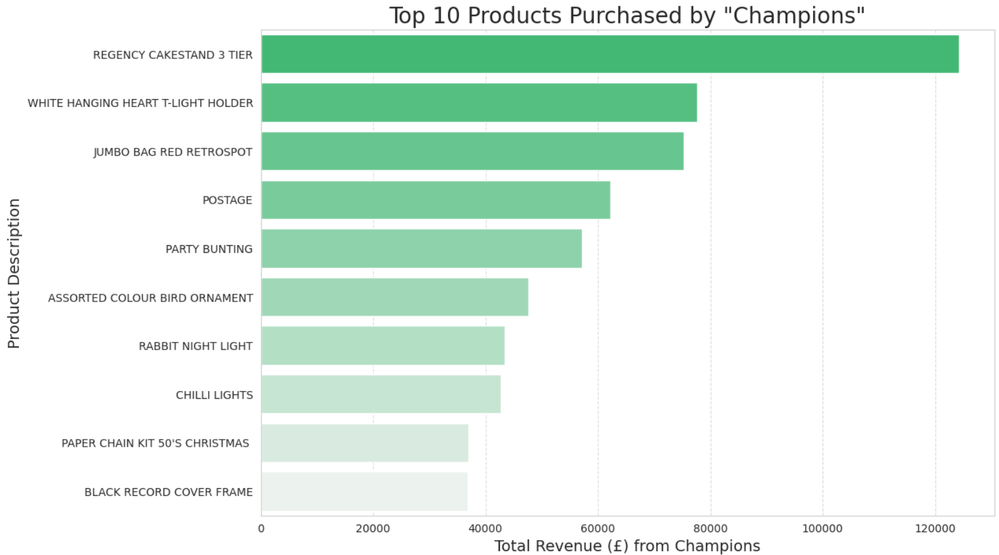
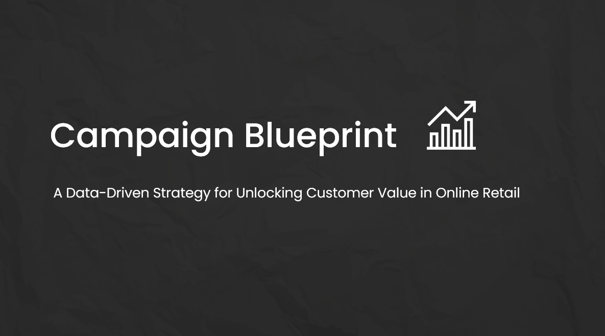

# Online Retail: RFM Customer Segmentation for Marketing Strategy

A data-driven approach to segment customers and design precision marketing campaigns using **Recency, Frequency, and Monetary (RFM)** analysis.

[](https://colab.research.google.com/drive/1l5woUdG29fQ3CajljsCIH-n0yQew5Aex?usp=sharing)

---

## Quick Navigation

- [Project Overview](#-project-overview)
- [Tech Stack](#️-tech-stack)
- [Methodology](#-methodology)
- [Key Findings & Insights](#-key-findings--insights)
  - [1. Pareto Effect: Revenue is Highly Concentrated](#1-pareto-effect-revenue-is-highly-concentrated)
  - [2. Customer Segmentation Outcomes](#2-customer-segmentation-outcomes)
  - [3. High-Value Product Preferences](#3-high-value-product-preferences)
- [Strategic Blueprint](#-strategic-blueprint)
- [How to Run This Project](#-how-to-run-this-project)

---

## Project Overview

This project leverages **RFM analysis** to transform raw transactional data into powerful customer intelligence.  
By analyzing purchasing behavior across **Recency, Frequency, and Monetary** dimensions, the project identifies key customer segments and designs targeted marketing strategies to **maximize retention and lifetime value**.

The dataset comes from the **UCI Online Retail Repository**, containing **500,000+ transactions** from a UK-based e-commerce company (Dec 2010–Dec 2011).

---

## Tech Stack


---

## Methodology

1. **Data Cleaning & Preprocessing**
   - Loaded 500K+ transaction records.
   - Removed missing `CustomerID` values (essential for segmentation).
   - Filtered out returns (negative `Quantity`) and extreme outliers to ensure data integrity.

2. **Exploratory Data Analysis (EDA)**
   - Analyzed monthly trends in revenue, orders, and customer activity.
   - Identified top products, countries, and repeat buyers contributing most to revenue.

3. **RFM Feature Engineering**
   - Computed **Recency**, **Frequency**, and **Monetary** values for 4,300+ customers.
   - Each metric quantified:
     - **Recency:** How recently a customer purchased.
     - **Frequency:** How often they purchased.
     - **Monetary:** How much they spent.

4. **Quantile-Based Segmentation**
   - Scored customers from **1 to 4** on each RFM metric based on quartiles.
   - Combined these into a unified **RFM Score**.
   - Classified customers into actionable cohorts:  
     **Champions**, **Potential Loyalists**, **At Risk**, **Can’t Lose**, and **Lost**.

5. **Strategic Deep-Dive**
   - Focused on the **‘Champions’** segment to identify key purchasing behaviors and brand affinities.


---

## Key Findings & Insights

### 1. Pareto Effect: Revenue is Highly Concentrated
- The **top 0.25% of customers** generate **17% of total revenue** — a textbook Pareto distribution.
- Indicates immense opportunity in **high-value customer retention** rather than broad acquisition.

---

### 2. Customer Segmentation Outcomes
| Segment | % of Customers | Description |
|----------|----------------|-------------|
| **Champions** | 37% | Frequent, high-spending customers — most profitable segment. |
| **Potential Loyalists** | 22% | Engaged but not yet consistent — strong upselling potential. |
| **At Risk** | 18% | Once-active customers showing signs of churn. |
| **Can’t Lose** | 12% | Historically high-value, now inactive — critical to win back. |
| **Lost** | 11% | Low engagement and low spending — deprioritize marketing spend. |



---

### 3. High-Value Product Preferences
- The **‘Champions’** cohort prefers **home décor, party supplies, and seasonal products**, often purchased in bulk.
- These preferences can directly inform:
  - Seasonal campaigns (e.g., holiday-themed offers)
  - Cross-selling and personalized bundles
  - Inventory prioritization for high-performing SKUs



---

## Strategic Blueprint

The final outcome is a **Campaign Blueprint** tailored for the **‘Champions’** segment — the most profitable group.

### Targeted Retention Strategy

1. **Exclusive Access**
   - Offer early access to new or limited-edition products aligned with known preferences.

2. **Loyalty Program**
   - Launch a premium membership tier with reward points, free shipping, or surprise gifts.

3. **Personalized Bundles**
   - Curate dynamic bundles of frequently co-purchased products to raise average order value.

4. **Reactivation Campaign**
   - For ‘At Risk’ and ‘Can’t Lose’ customers, deploy reminder emails or win-back discounts.

[](https://github.com/VivoSorhie/RFM-Customer_Segmentation/blob/main/campaign-blueprint.pdf)

---

## How to Run This Project

1. **Clone the Repository:**
   ```bash
   https://github.com/VivoSorhie/RFM-Customer_Segmentation.git
   ```

2. **Install Dependencies:**
   ```bash
   pip install pandas numpy matplotlib seaborn plotly scikit-learn
   ```

3. **Run the Notebook:**
   - Open the `rfm_customer_segmentation.ipynb` file in **Google Colab** or **Jupyter**.
   - Upload the dataset (`Online_Retail.csv`).
   - Run cells sequentially to reproduce all analysis, segmentation, and visualizations.
